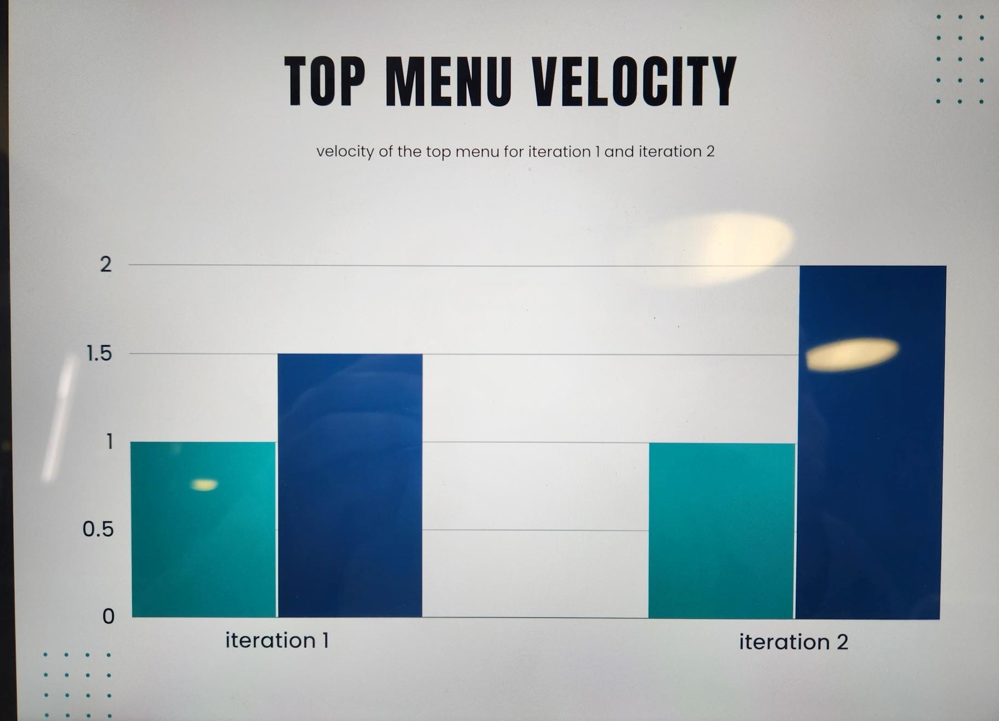

For our project the top menu bar for our app was more difficult than expected, at first
we didn’t anticipate the amount of pages we were going to have and we kept making new
top menus on every page that we made. For Iteration 1 we had made the mistake having all
the features we wanted separated and on different iterations, this lead to us adding tops
bars that worked for the added feature at the time. Example we wanted a search bar on the
home page so we added the search bar then we wanted a home button so we added it to the
pages we made, then we wanted categories and we tried to add it to the top menu but there
was no space, for iteration 2 we added more features that required the top menu such as user.
By iteration 2 we were down to 2 -3 versions of top menu bars. For iteration 3 we want to 
standardize the top menu bar for all pages that exist and that will be created.

For iteration 3 we will standardize the top bar for all menus, by adding in a drop down menu 
that will allow us to have all the needed tabs for user, cart, wishlist and categories. It will
be determiend successful if we are able to implement the top menu for all pages outside of our 
front page, and all the required feautures in the drop down menu work and are clickable.

